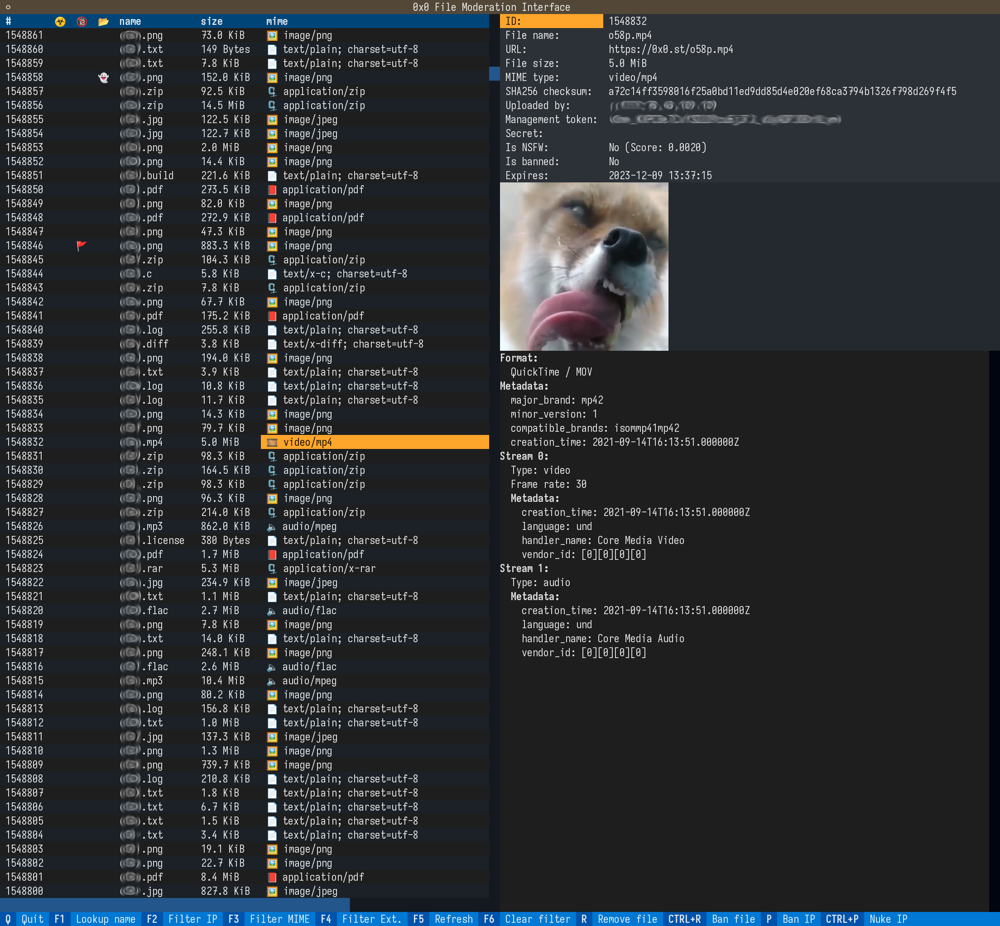

The Null Pointer
================

This is a no-bullshit file hosting and URL shortening service that also runs
`0x0.st <https://0x0.st>`_. Use with uWSGI.

Configuration
-------------

To configure 0x0, copy ``instance/config.example.py`` to ``instance/config.py``, then edit
it.   Resonable defaults are set, but there's a couple options you'll need to change
before running 0x0 for the first time.

By default, the configuration is stored in the Flask instance directory.
Normally, this is in `./instance`, but it might be different for your system.
For details, see
`the Flask documentation <https://flask.palletsprojects.com/en/2.0.x/config/#instance-folders>`_.

To customize the home and error pages, simply create a ``templates`` directory
in your instance directory and copy any templates you want to modify there.

If you are running nginx, you should use the ``X-Accel-Redirect`` header.
To make it work, include this in your nginx config’s ``server`` block::

    location /up {
        internal;
    }

where ``/up`` is whatever you’ve configured as ``FHOST_STORAGE_PATH``.

For all other servers, set ``FHOST_USE_X_ACCEL_REDIRECT`` to ``False`` and
``USE_X_SENDFILE`` to ``True``, assuming your server supports this.
Otherwise, Flask will serve the file with chunked encoding, which has several
downsides, one of them being that range requests will not work. This is a
problem for example when streaming media files: It won’t be possible to seek,
and some ISOBMFF (MP4) files will not play at all.

To make files expire, simply run ``FLASK_APP=fhost flask prune`` every
now and then. You can use the provided systemd unit files for this::

    0x0-prune.service
    0x0-prune.timer

Make sure to edit them to match your system configuration. In particular,
set the user and paths in ``0x0-prune.service``.

Before running the service for the first time and every time you update it
from this git repository, run ``FLASK_APP=fhost flask db upgrade``.

Moderation UI
-------------

0x0 features a TUI program for file moderation. With it, you can view a list
of uploaded files, as well as extended information on them. It allows you to
take actions like removing files temporarily or permanently, as well as
blocking IP addresses and associated files.

If a sufficiently recent version of python-mpv with libmpv is present and
your terminal supports it, you also get graphical file previews, including
video playback. Upstream mpv currently supports sixels and the
`kitty graphics protocol <https://sw.kovidgoyal.net/kitty/graphics-protocol/>`_.
For this to work, set the ``MOD_PREVIEW_PROTO`` option in ``instance/config.py``.

Requirements:

* `Textual <https://textual.textualize.io/>`_

Optional:

* `python-mpv <https://github.com/jaseg/python-mpv>`_
  (graphical previews)
* `PyAV <https://github.com/PyAV-Org/PyAV>`_
  (information on multimedia files)
* `PyMuPDF <https://github.com/pymupdf/PyMuPDF>`_
  (previews and file information for PDF, XPS, EPUB, MOBI and FB2)
* `libarchive-c <https://github.com/Changaco/python-libarchive-c>`_
  (archive content listing)

.. note::
    `Mosh <https://mosh.org/>`_ currently does not support sixels or kitty graphics.

.. hint::
    You may need to set the ``COLORTERM`` environment variable to
    ``truecolor``.

.. tip::
    Using compression with SSH (``-C`` option) can significantly
    reduce the bandwidth requirements for graphics.

NSFW Detection
--------------

0x0 supports classification of NSFW content via Yahoo’s open_nsfw Caffe
neural network model. This works for images and video files and requires
the following:

* Caffe Python module (built for Python 3)
* `PyAV <https://github.com/PyAV-Org/PyAV>`_

Virus Scanning
--------------

0x0 can scan its files with ClamAV’s daemon. As this can take a long time
for larger files, this does not happen immediately but instead every time
you run the ``vscan`` command. It is recommended to configure a systemd
timer or cronjob to do this periodically. Examples are included::

    0x0-vscan.service
    0x0-vscan.timer

Remember to adjust your size limits in clamd.conf, including
``StreamMaxLength``!

This feature requires the `clamd module <https://pypi.org/project/clamd/>`_.

Network Security Considerations
-------------------------------

Keep in mind that 0x0 can fetch files from URLs. This includes your local
network! You should take precautions so that this feature cannot be abused.
0x0 does not (yet) have a way to filter remote URLs, but on Linux, you can
use firewall rules and/or namespaces. This is less error-prone anyway.

For instance, if you are using the excellent `FireHOL <https://firehol.org/>`_,
it’s very easy to create a group on your system and use it as a condition
in your firewall rules. You would then run the application server under that
group.
